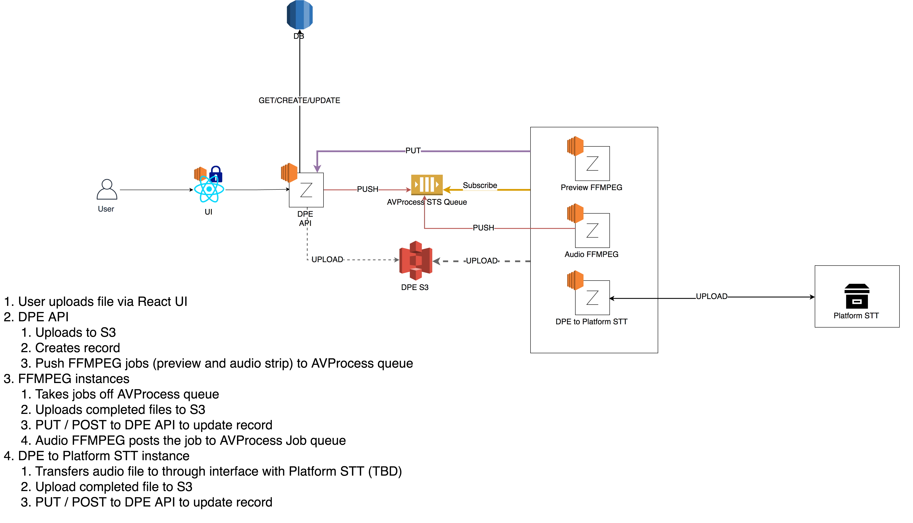

# Architecture for Digital Paper Edit

* Status: pending <!-- optional -->
* Deciders: Pietro, Eimi <!-- Laurien, Mark Langton, James Gruessing -->
* Date: 2019-04-23

Technical Story: https://github.com/bbc/digital-paper-edit/issues/1 <!-- optional -->

## Context and Problem Statement

Digital Paper Edit has three milestones. Transcript, Paper-edit, and Annotation.
We want to make sure that during the Transcript phase, we have a solid
architecture to provide storage for uploaded content and transcription to be
used in later phases. We want to consider technologies from a resilience,
scalability, cost point of view, opensource compatibility and extensibility.

## Decision Drivers

* resilience
* scalability
* cost
* number of users
* opensource compatibility
* extensibility

## Considered Options

* Framework and infrastructure: Docker vs Serverless vs Cosmos
* Components: Lambda vs EC2 (AWS)
* Storage: local vs S3
* DB: PostgreSQL (RDS) vs DynamoDB vs MongoDB
* Queues: STS vs RabbitMQ

### Potential Problems in Options

#### Framework and infrastructure: Serverless vs Docker vs Cosmos

Serverless framework makes it easy to deploy serverless and
many other components using a cli. It might be easy to begin
with and is quick to deploy serverless, but becomes more difficult to maintain
with transfer (local development vs production). It also isn't platform
agnostic, which was what was initially suggested. It will give you the
flexibility of using another platform, but you will still need to configure
platform specific variables in your code. Developing and using this means we
also lack transparency and resilience because the deployment occurs on someone's
local development.

Docker was considered to simplify the orchestration of microservices. Using docker means we could
have a separation of concerns - the OS and the application. However, using this means we would still
need to select a platform (AWS / GCP) and deploying it on the VM. This
also implies that there is an extra level of abstraction: a Docker image (VM)
inside a cloud VM. Debugging it also requires extra set up. If we decided to use
Docker, we will not be able to use Cosmos which would give you the bulk of the
configuration including HTTPS access for free.

Using AWS and Cosmos means tying into the AWS architecture, makes it very
difficult to move away. There is also overhead on learning how to use Cosmos.
There is also less flexibility in the way we would do deployments - we would
need to set up in Jenkins and be restricted to RHEL7, using RPMs as the
packaging method.

#### Components: Lambda vs EC2 (AWS)

##### Lambda Pros and Cons

From [this article](https://dzone.com/articles/the-pros-and-cons-of-aws-lambda),
the pros and cons can be summarised as the following.

Pros:

* Reduced cost of execution
* Improved application resiliency
* Decouple server architecture to code
* Idempotent

Cons:

* Loss of control over environment
  * machine - not guaranteed to have the same AMI
  * no OS capabilities
  * hot/cold function - causes delays
* Packaging lambda with dependencies could be problematic
* More complex call patterns
  * Runtime limitations + Time outs
  * Time outs removed with step-functions? - unverified
* Could be slower

#### Storage: local vs S3

S3 will benefit us in terms of resilience and remote storage. However this could introduce issues
for infoSec if we are storing business critical items. S3 is easy to integrate with Platform STT.

#### Database: Sqlite vs PostgreSQL vs DynamoDB vs MongoDB

Using PostgreSQL flexibility of using JSON in columns. MongoDB and DynamoDB can
be too verbose. We were quite clear on the shape of the
database model already.

I was reading an article about [Guardian’s migration from MongoDB to Postgres](https://www.infoq.com/news/2019/01/guardian-mongodb-postgresql).
It seems like many organisations are moving to Postgres and RDS (you can see
from the article linked before). I think if we wanted this to be a long-lived
project, we want to ensure that it’s reliable and resilient. If we wanted to
use JSON data, then yes we need it to be Postgres. 

Sqlite is not good enough to be a fully production database. It doesn’t scale
very well either. However Sqlite could be used inside Electron, for single user
access. Also using PostgreSQL already meant that the JSON would give us enough flexibility.

##### EC2 local server vs RDS

Considered requirements such as:

* Maintaining state of transcripts once it’s uploaded
* speed to access the database
* cost

The database is critical to the operation and we also need modularity.
It separates out the database as a separate server, that is not maintained by
us, which is quite useful. RDS will give us the benefit of backing up as well.
If the server was on EC2, the database could lose information when the instance
failsover. Additionally, based on the size of the database, we would need to
increase the size of the machine, adding on to the cost. Although, for what we
have it will be a smaller cost than having an RDS instance initially.

### We ruled out

* Hosting a website in S3 with CloudFront - no HTTPS cert-based authentication,
only IP address based authentication.

## Decision Outcome

Both options will have the advantages of:

<<<<<<< HEAD
* being maintainable,
* being transparent
* being transferable
* using existing pipelines
  * It will have the benefits of using Cosmos, which means we will automatically
have cert-based security and ELBs. We will also have a solid CI process around
the project, including transparency around deployment issues.

Both options will have the disadvantages of:

* Initial learning curve around Cosmos (need to understand RHE7).
* Extra files for Cosmos will be in an opensource repository, which will require
  additional documentation and security checking.
* Cost of AWS - not entirely sure how much it will be right now, but it will be
  a minimum of 4 instances running in ``t2.small` for Option 1, and 2
  `t2.small` instances for Option 2, plus lambda executions as well as SQS and
  S3.
* Locking in with AWS.
=======
* maintainable,
* transferable
* using existing pipelines

Both options will have the disadvantages of:

* Initial 
>>>>>>> a7c87c0... Adding ADR draft for transcript architecture

### Option 1

#### Advantages

* Common pattern and will be easier to set up locally.

This is good for the opensource developers - who will not need AWS accounts to
test integration locally with Lambdas and Gateways.

#### Disadvantages

* Cloudformation template will remain in the opensource repository. This may be
  something that isn't a problem, it's just a bit puzzling for the users.

### Option 2

#### Advantages

* Cheaper as there isn't a full instance running - Lambda.
<<<<<<< HEAD
* Better for the environment (less operational CO2 cost)
=======
* Better for the environment
>>>>>>> a7c87c0... Adding ADR draft for transcript architecture

#### Disadvantages

* There could be a timeout issue for Lambda
<<<<<<< HEAD
* Difficulty in debugging due to Lambda
=======
* Difficulty in debugging
>>>>>>> a7c87c0... Adding ADR draft for transcript architecture
