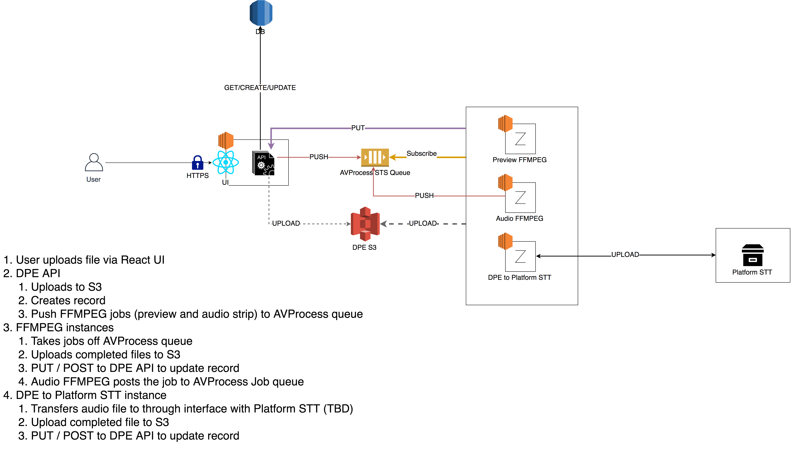

# Architecture Security

* Status: pending
* Deciders: Pietro, Eimi, Ben (InfoSec)
* Date: 2019-05-09

Technical Story: https://github.com/bbc/digital-paper-edit/issues/1

## Context and Problem Statement

These are notes based on the InfoSec meeting held on the 30th of May 2019.

## Decision Drivers

* Ease of use for journalists when system authenticates them
* Security levels (public, protect, or restrict)
* Data retention based on inactivity
* Complexity

## Considered Options

### Authentication

Cert-based authentication is fine for now. We might want to move to BBC Login
(SSO). This will make it easier for journalists to access the system. When
there's a mobile version of the application, it will simplify accessing the system, as people will have to follow an additional step to [enrol their devices into MDM](https://confluence.dev.bbc.co.uk/display/ops3/MDM+Airwatch+Cluster) if using a cert-based authenticator.

### Data Retention Period

90 days of inactivity as the data retention period and logic.
### Levels of Security

There are currently 3 levels of security. We are aiming for the second tier -
which is **protect**. The Electron App, which will be out of scope initially,
will be in **restrict** - as it will require locally cached pre-production
files and offline STT.

In order to have a **protect** level system we must:

* S3:
  * encrypt (bucket-only, not contents of bucket) and private
  * If hosting website inside S3, we must use Cloudfront to authenticate and
    write our own proxy to redirect to S3.
* RDS:
  * toggle encrypt option
* Communication between assets:
  * use either IAM policies to go between VPC (SecurityGroups?) or use different
    subnets to restrict communciations

For **restrict** level, we must:

* encrypt the **contents*** of S3 and RDS.
    
### Option 1 (Suggested by Ben)**

* Some examples by Ben:
    - https://confluence.dev.bbc.co.uk/display/mdm/AWS+setup
    - https://confluence.dev.bbc.co.uk/display/mdm/Apache+Configuration
    - https://confluence.dev.bbc.co.uk/display/mdm/Generating+Signed+Cookies%3A+Not+implemented+-+does+not+work
He suggested adding a load balancer or Cloudfront in front of EC2 that serves
React, then adding VPCs. The VPC can be a singular or multiple. He also
recommended within these VPCs to use different subnets for the components to talk
to each other.

#### Concerns

* We would need to keep the web endpoint open to the public and authenticate via
  a proxy server in Apache. This seems to require writing our own Apache server.
  In this case, I would prefer to use Nginx, as it is more resilient and can
  replace Apache easily.
* We would need to have an EC2 or Lambda instance to do the redirects.
  In this case, it might be simpler to have a web endpoint in EC2.
* This is not a traditional web UI and might need a more complex set up than a
  static web hosted set up.

### Option 2

* Following the guidelines above to implement a **protected** level service, we
  can host the UI in EC2 instance in Cosmos. Cosmos will automatically give us
  the ELBs, and most imporantly the automatic authentication capabilities.
* The UI and backend server (Express) can be both hosted on the same EC2 instance, which will
  reduce the APIs exposure only to the UI. The fronting UI will have it's own Express server. This means that the UI Express will communicate with the API Express via `localhost`. The backend server will only be on
  `localhost` and won't be exposed to the wider world.
* Although the UI and Express server live in the same box, they are still both
  in the Cosmos VPC, with cert authentication.
* We can use SecurityGroups between ELBs to restrict communication between each
  AWS service.

## Decision Outcome

We are going with Option 2 as this provides us with security, while
providing a simpler way to set up access for journalists.

Ben Thornton has agreed to this.

The benefits of this approach means that we will be
using existing BBC services to implement security, rather than implementing our
own servers. A single VPC is sufficient for **protected** levels of service, and
we can apply SecurityGroups in between to have added security.

The downside of this approach is that it is not using SSO but we can add that
later on. 

In terms of data retention, we will go with the recommended 90 days.

