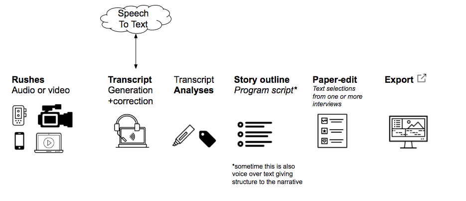

# Intro

> What if creating an audio or video program was as simple as editing a word document?

Aim of the project is to make video and audio production:

*   Faster
*   Easier
*   Cheaper 
*   More accessible

Can also see this as [GDocs slides](https://docs.google.com/presentation/d/1M6w8xNA5U4KtxQYrZ1gmPhBqwQbwMOnYavp3RV0HM4Q/edit#slide=id.g33ba2bc411_0_1)

See [Domain knowledge section for more details](./guides/domain-knowledge.md)

# Program post-production workflow - Overview

Program post-production Steps, for Audio/Video - documentary 

*Sometime these steps overlap

This is the process for crafting a story mostly out of audio or video interviews.  See [domain Knowledge  - Paper-editing](./guides/domain-knowledge.md) for more background info.

