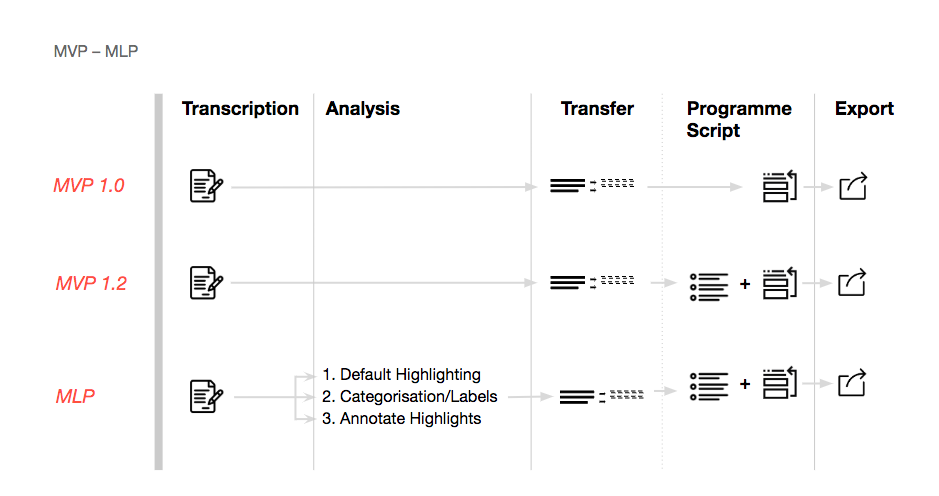
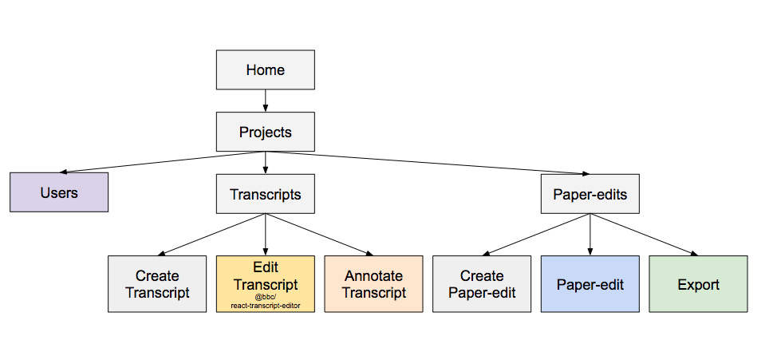
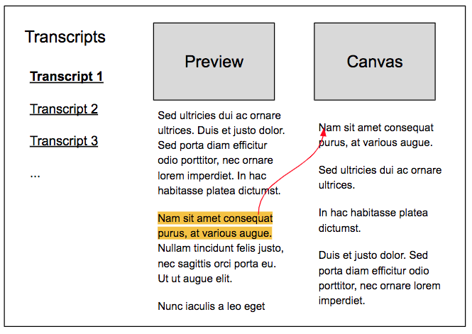
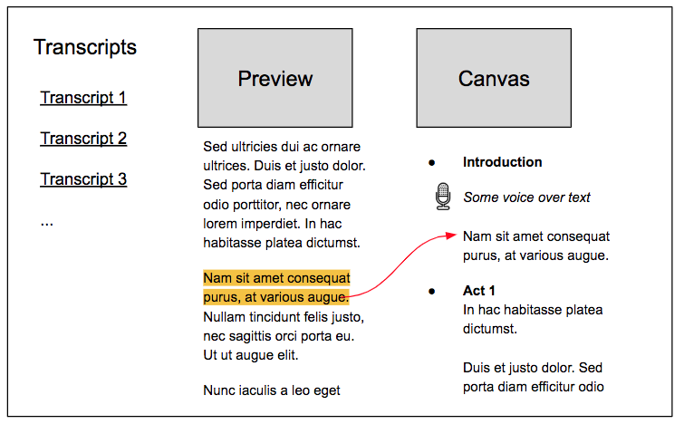
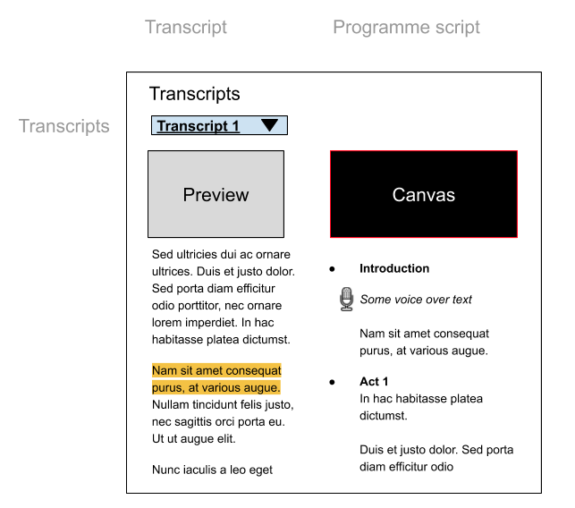
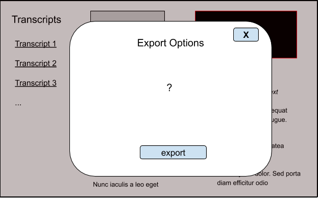

# User journeys  - overview

High level, **low fidelity** overview of the main parts of the user journey 

The workflow can scale up or down to tackle more simpler or complex productions. 
- At a minimum the user can take a text snippets ad add it to a programme script. 
- If they wish they can use an outline in the programme script to craft their story
- They can also add an analyses stage where they can    
    1. use default highlighting to identify relevant content
    2. categories highlights with labels
    3. annotate highlights

_The content is then searchable and filterable, by text, speakers and labels. To make it easier to review it and/or add it to a programme script._

<!-- User can 
- select and transfer text snippets into programme script export

|       |Transcription  | Analyses                  |  Transfer    | programme script    |  Export   |
|---    |---            |---                        |---           |---                  |---        |
|MVP 1.0|   📝          |   →                       |  ✔️         | reorder             |  ✔️       |
|MVP 1.2|   📝          |   →                       |  ✔️         | outline + reorder   |  ✔️       |
|MLP    |   📝          | 1.Default highlighting    |  ✔️         | outline + reorder   |  ✔️       |
|MLP    |   📝          | 2.Categorization/Labels   |  ✔️️️         | outline + reorder   |  ✔️       |
|MLP    |   📝          | 3.Annotate highlights     |  ✔️         | outline + reorder   |  ✔️       | 

-->

## Site map 

## Projects

A user can create a project, add users to the project. And create a transcript and a paper-edit within that.

<!-- ## Users

Within a project, the user can or remove other users to the project

 -->

## Transcripts

### Transcript - Editing

User can correct the text in a transcript 

See @bbc/react-transcript-editor -  [https://github.com/bbc/react-transcript-editor](./img/https://github.com/bbc/react-transcript-editor) 

See a demo here: [https://bbc.github.io/react-transcript-editor/iframe.html?id=transcripteditor--default](./img/https://bbc.github.io/react-transcript-editor/iframe.html?id=transcripteditor--default)

### Transcript - Highlights

#### Adding Highlights and annotations

#### Searching and filtering 

## Paper-edit

See  [domain Knowledge  - Paper-editing](./img/https://docs.google.com/document/d/17F9Qd3e0n-Ji9ESP4CzA5GfCiu2VcuuSdFcDD-4CUGo/edit#heading=h.ne7f93gnbo7n) for conceptual background on analogue workflow

### Paper-edit - Program script

*   Story outline 
*   program script with paper-cuts

See taxonomy at the end of the doc for more info on terminology.

#### Paper-edit - Program script - Voice over 

#### Paper-edit - Program script - Preview

## Export

### EDL 

*   Limitations: 1 video track 
*   Adv: widely compatible with editing software 

Docs on EDL format

[https://autoedit.gitbook.io/documentation/appendix/edl-format](./img/https://autoedit.gitbook.io/documentation/appendix/edl-format) 

Module on github [https://github.com/pietrop/edl_composer](./img/https://github.com/pietrop/edl_composer) 

Module on npm: [https://www.npmjs.com/package/edl_composer](./img/https://www.npmjs.com/package/edl_composer)

### XML

*   Multiple tracks
*   XML schema different for different editing softwares

### Mp4

*   Ffmpeg-remix  by Laurian \
[https://www.npmjs.com/package/ffmpeg-remix](./img/https://www.npmjs.com/package/ffmpeg-remix)  \
Very fast trim and concat of mp4s, by re-writing header info and avoiding transcoding.  \
From palestinian Remix [https://interactive.aljazeera.com/aje/palestineremix/](./img/https://interactive.aljazeera.com/aje/palestineremix/)   
*   See autoEdit.io export paper-edit as mp4 for example 

### Social Media  

→ possibly out of scope for now ← 

*   With burn in captions & auto generated waveform  if audio 
    *   [https://github.com/pietrop/tweet-that-clip](./img/https://github.com/pietrop/tweet-that-clip) 
    *   Example: audio with auto generated waveform  \
[https://twitter.com/pietropassarell/status/1054128871694573568](./img/https://twitter.com/pietropassarell/status/1054128871694573568) 
    *   See screenshot here for example social media [https://github.com/OpenNewsLabs/autoEdit_2/issues/74](./img/https://github.com/OpenNewsLabs/autoEdit_2/issues/74)

<!-- Docs to Markdown version 1.0β17 -->
